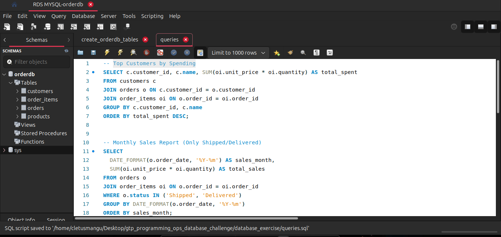

# gtp_programming_ops_database_challenge (AWS RDS + Flask + FastAPI)

This project demonstrates a mini e-commerce analytics system built using **AWS RDS (MySQL)** as the backend database and two RESTful APIs developed with **Flask** and **FastAPI** to expose complex SQL queries. The APIs are documented using **Postman** for easy access.

---

## Project Summary

- **Database**: MySQL on Amazon RDS
- **Backend**: Python (Flask & FastAPI)
- **API Tooling**: Postman
- **Goal**: Analyze sales/customer data and expose analytics via APIs
- **Result**: Advanced SQL queries and API challenge solved in full detail

---

## Technologies Used

| Technology     | Purpose                                 |
|----------------|------------------------------------------|
| AWS RDS (MySQL)| Cloud-hosted relational database         |
| Python         | Programming language                     |
| Flask          | Lightweight REST API framework           |
| FastAPI        | High-performance API framework           |
| MySQL Workbench| DB management and query execution        |
| Postman        | API testing and documentation            |
| GitHub         | Code versioning and submission platform  |

---

## Setup Steps (Summarized)

1. **Create MySQL DB on AWS RDS**
   - Enable public access, open port 3306 to your IP
   - Connect using MySQL Workbench

2. **Initialize Database**
   - Create 4 tables: `customers`, `products`, `orders`, `order_items`
   - Populate with sample data

3. **Run Analytical Queries**
   - Top customers by spending
   - Monthly sales (shipped/delivered)
   - Products never ordered
   - Avg. order value by country
   - Frequent buyers (2+ orders)

4. **Develop APIs**
   - `flask_api/app.py` exposes endpoints using Flask
   - `fastapi_api/main.py` exposes same logic via FastAPI
   - Connect APIs to RDS using `pymysql` or `mysql-connector-python`

5. **Document APIs**
   - Import `postman_collection.json` into Postman for testing

---

## Query Endpoints

| Endpoint Path          | Query Description                       |
|------------------------|------------------------------------------|
| `/top-customers`       | Shows top customers by total spend       |
| `/monthly-sales`       | Reports monthly sales totals             |
| `/never-ordered`       | Lists products that were never ordered   |
| `/avg-order-value`     | Shows average order value per country    |
| `/frequent-buyers`     | Lists customers with 2+ orders           |

Both Flask and FastAPI serve the same endpoints.

---

## Testing & Validation

 - Verified connection to RDS from APIs  
 - Query results match expected outputs  
 - Postman tested and exported  

---

## Screenshots

-  – SQL Query Results  
-  – Flask Endpoint Result  
-  – FastAPI Endpoint  
-  – API Docs in Postman  

---

## 👤 Author

**[Cletus Nehinlalei Mangu]**  
DevOps & Cloud Engineer at AmaliTech GH

---
